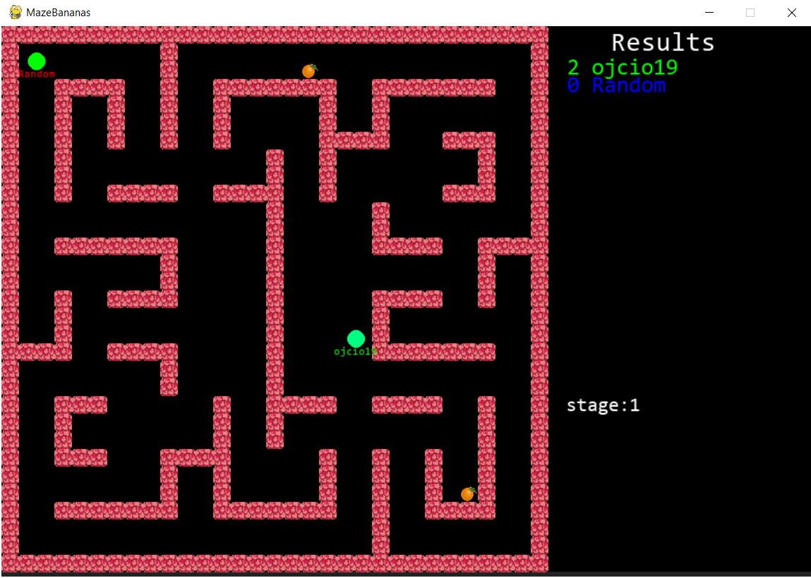

# MazeBananas

## Arcade game over the internet

The main goal of the game is to collect as many fruits as you can. Rounds are divided into specific time periods. Fruit spawns at random time.



## Run game

To run the game you must have at least two computers with IP in the same network (e.g. using the same WiFI).

First start server by running

```
python server.py
```

After it users can connect (check IP address, see network.py line 8):
```
self.host = "192.168.56.1"
```

To connect

```
python client.py
```